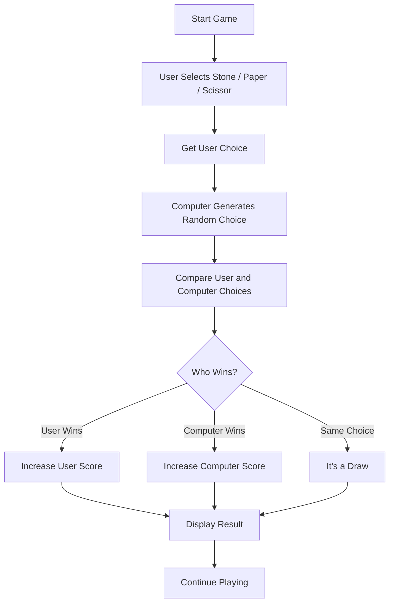

# 🪨 Stone Paper Scissor ✋✂️

A simple and interactive **Stone Paper Scissor** game built using **HTML, CSS, and JavaScript**.

The player selects **Stone, Paper, or Scissor**, while the computer randomly generates its choice. The game then compares both choices and displays the result.

---
<h2>🛠️ Technologies Used</h2>

<table>
  <tr>
    <td align="center">
      
      <br><b>HTML</b>
    </td>
    <td align="center">
      
      <br><b>CSS</b>
    </td>
    <td align="center">
      
      <br><b>JavaScript</b>
    </td>
  </tr>
</table>
---

## 🎮 Live Demo

> 🚀 https://splendorous-cat-afd0b8.netlify.app/)

---

## 📌 Project Overview

This project is a beginner-friendly JavaScript game created to practice:

* DOM Manipulation
* JavaScript Events
* Event Listeners
* Functions
* Arrays
* Random Number Generation
* Conditional Statements
* CSS Styling
* User Interaction

---

## ✨ Features

* 🪨 Stone selection
* 📄 Paper selection
* ✂️ Scissor selection
* 🤖 Computer generates a random choice
* 🏆 Automatically determines the winner
* 📊 User and computer score tracking
* 🖱️ Interactive click-based gameplay
* 🎨 Simple and responsive interface

---

## 🛠️ Technologies Used

| Technology      | Purpose                             |
| --------------- | ----------------------------------- |
| 🌐 HTML         | Structure of the game               |
| 🎨 CSS          | Styling and layout                  |
| ⚡ JavaScript    | Game logic and interaction          |
| 🐙 Git & GitHub | Version control and project hosting |

---

## 🧠 How the Game Works

The basic game flow is:



---

## ⚔️ Game Rules

| User Choice | Computer Choice | Result        |
| ----------- | --------------- | ------------- |
| 🪨 Stone    | ✂️ Scissor      | User Wins     |
| 📄 Paper    | 🪨 Stone        | User Wins     |
| ✂️ Scissor  | 📄 Paper        | User Wins     |
| Same        | Same            | Draw          |
| Otherwise   | Otherwise       | Computer Wins |

### Simple Rule

**Stone beats Scissor**
**Scissor beats Paper**
**Paper beats Stone**

---

## 📂 Project Structure

```text
stone-paper-scissor/
│
├── index.html
├── style.css
├── app.js
│
├── rock.png
├── paper.png
└── scissors.png
```

---

## 💻 JavaScript Concepts Used

### 1. DOM Selection

The game choices are selected using:

```javascript
document.querySelectorAll(".choice");
```

### 2. Event Listener

Each choice listens for a click:

```javascript
choice.addEventListener("click", () => {
    // game logic
});
```

### 3. Getting Element ID

The selected choice can be identified using:

```javascript
const choiceId = choice.getAttribute("id");
```

### 4. Random Computer Choice

JavaScript's random number generation is used to make the computer's choice unpredictable.

### 5. Conditional Logic

`if`, `else if`, and `else` are used to determine the winner.

---

## 🎯 Learning Objectives

Through this project, I practiced:

* Selecting HTML elements using JavaScript
* Handling user click events
* Working with DOM elements
* Using `forEach()`
* Using callback functions
* Reading HTML attributes
* Generating random values
* Implementing game logic
* Updating the webpage dynamically

---

## 🚀 How to Run the Project

### 1. Clone the repository

```bash
git clone https://github.com/mohdhmza098/stone-paper-scissor.git
```

### 2. Open the project

Open the project folder in **VS Code**.

### 3. Run the game

Open `index.html` in your browser.

You can also use the **Live Server** extension in VS Code for a better development experience.

---

## 🔮 Future Improvements

Some improvements that can be added later:

* 🔄 Reset Game button
* 🏆 Winner announcement
* 📈 Better score dashboard
* 🎵 Sound effects
* 🌙 Dark mode
* 📱 Improved mobile responsiveness
* 🤖 Better computer AI
* 🏅 Game history
* ✨ Animations and transitions

---

## 📸 Project Preview

 ./gamePreveiw.png

---

## 👨‍💻 Author

**Mohd Hamza**

B.Tech — Data Science & Artificial Intelligence
Integral University, Lucknow

### GitHub

[github.com/mohdhmza098](https://github.com/mohdhmza098)

---

## ⭐ Support

If you found this project useful, consider giving the repository a ⭐ on GitHub.

---

### 📚 Project Status

**Status:** 🚧 Learning Project

This project was created as part of my JavaScript learning journey to strengthen my understanding of **DOM manipulation, events, callbacks, and interactive web development**.


